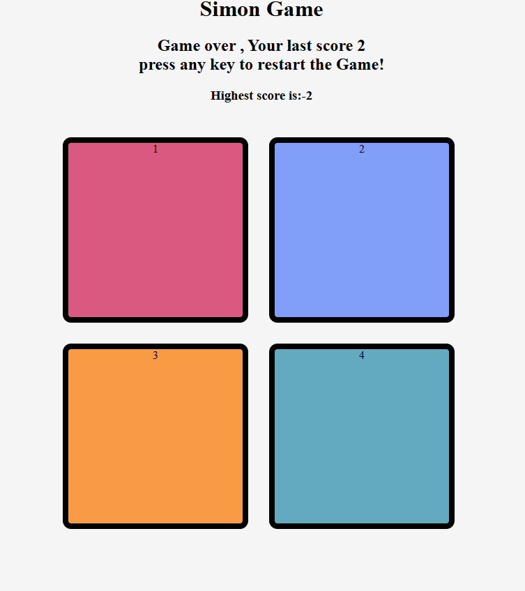

# simon-game
A classic Simon memory game built using HTML, CSS, and JavaScript.
Simon Game 🎮
This is a simple Simon Game built using HTML, CSS and JavaScript.

The main idea of the game is to remember the pattern shown by the game and repeat it by clicking the buttons in the correct order.

# How to Play:-
Press a key to start the game.

The game will show a color pattern.

Click the buttons in the same order.

Every time you get it right, the pattern gets longer.

If you click the wrong button, the game is over.

# Technologies Used
HTML

CSS

JavaScript

# What I Learned
I made this project to practice JavaScript and understand things like DOM manipulation, event listeners, arrays and game logic.

It was a small project, but it helped me understand how different parts of JavaScript work together to make an interactive website.
# Screenshot
